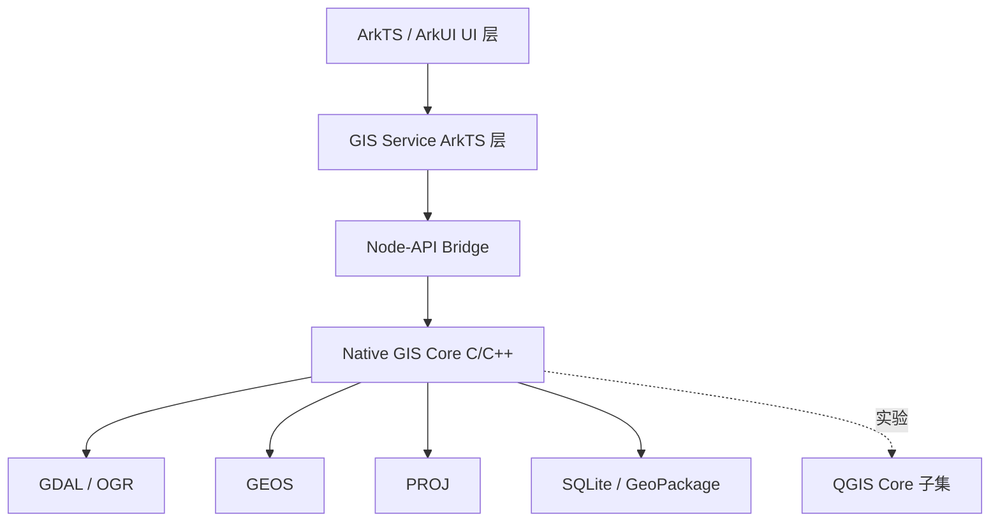

# GeoNest GIS 完整移植方案

版本：v0.2  
日期：2026-06-22  
项目路径：`F:\HarmonyProjects\GeoNest`  
应用名：`GeoNest GIS` / `地巢GIS`  
Bundle：`com.fanha.geonest`

## 1. 项目定位

GeoNest GIS 是一个面向 HarmonyOS 的原生移动 GIS 应用。第一阶段不追求完整复刻 QGIS Desktop，而是先移植和复用 QGIS/OSGeo 生态中的核心 GIS 能力，做出一个能稳定加载、查看、编辑、导出 Shapefile 的可用版本。

长期目标是逐步兼容 QGIS 工程、样式、字段配置和外业采集流程，但 UI、交互和系统集成使用 HarmonyOS 原生实现。

## 2. 总体目标

### 2.1 第一版 MVP 目标

- 导入 `.shp/.shx/.dbf/.prj/.cpg` 文件组。
- 支持点、线、面图层显示。
- 支持地图平移、缩放、全图、点选、框选。
- 支持查看图层字段和要素属性。
- 支持编辑属性。
- 支持新增、删除、移动、修改点线面要素。
- 支持保存为新的 Shapefile。
- 支持读取 `.prj` 并进行基础坐标系识别。
- 支持中文路径、中文字段、常见 DBF 编码处理。

### 2.2 第一版不做的内容

- 不移植完整 QGIS Desktop GUI。
- 不支持 Python 插件体系。
- 不支持 Processing 模型器、GRASS、SAGA、QGIS Server。
- 不支持 3D、点云、布局打印、复杂表达式渲染。
- 不直接使用 QGIS 名称和品牌。

## 3. 技术路线结论

第一阶段采用“双轨路线”：

1. 生产主线：`ArkTS/ArkUI + HarmonyOS NDK + GDAL/GEOS/PROJ`
2. 研究支线：尝试裁剪编译 `QGIS Core`，只引入非 GUI 的核心类

这样做的原因是：完整 QGIS 强依赖 Qt、Python、桌面 GUI 和大量插件机制，直接移植到 HarmonyOS 原生应用风险过高。先把 OSGeo 核心库跑通，可以更快得到可用 App；同时保留 QGIS Core 兼容实验，为后续读取 QGIS 工程和样式打基础。

当前工程已经默认启用生产主线：`entry/build-profile.json5` 使用 `GEONEST_USE_GDAL=ON`，`libgeonestgis.so` 通过 GDAL/OGR 打开矢量数据。QGIS Core 后端代码和 CMake 开关已保留，但本地 `D:\下载\QGIS-master\QGIS-master` 是 QGIS 4.1.0 master，构建已推进到 Qt6 依赖处，目前缺少 Qt6/OHOS 包。

## 4. 许可策略

### 4.1 许可证影响

- QGIS：GPLv2+。
- QField：GPLv2+。
- GDAL/OGR：MIT 风格开源许可证。
- PROJ：X/MIT。
- GEOS：LGPL。
- SpatiaLite：MPL/GPL/LGPL 三许可。
- MapLibre：开源，具体模块按其仓库许可证确认。

### 4.2 项目决策

如果项目直接包含或派生 QGIS/QField 源码，并对外发布 App，则 GeoNest GIS 应按 GPL 路线管理，准备公开对应源码。

如果希望保留更灵活的商业闭源空间，第一阶段应避免直接链接 QGIS/QField 代码，只使用 GDAL/GEOS/PROJ 等更宽松或弱 copyleft 的基础库。当前方案默认第一阶段走这个方向，QGIS Core 放在实验分支中验证。

## 5. 目标架构



### 5.1 ArkTS / ArkUI 层

职责：

- 首页和项目列表。
- 文件导入。
- 地图画布。
- 图层面板。
- 属性表。
- 编辑工具栏。
- 导出入口。
- 错误提示和进度状态。

约束：

- `.ets` 代码遵守 ArkTS 限制。
- 不使用 `any`、`unknown`、解构、动态字段访问、`for...in`。
- 用户可见字符串放入资源文件。
- 大量数据不直接放入 ArkUI 状态树。

### 5.2 Node-API Bridge

职责：

- 将 ArkTS 调用转换为 C/C++ 调用。
- 控制 native 对象生命周期。
- 将 native 错误转换为稳定错误码。
- 将几何和属性转换为 ArkTS 可消费的数据结构。

设计原则：

- Bridge 接口保持少而稳定。
- 不把 QGIS/GDAL 内部对象直接暴露给 ArkTS。
- 大数据查询按视口分页和简化。

### 5.3 Native GIS Core

职责：

- 图层打开、关闭、缓存。
- Shapefile 读写。
- 坐标系识别和转换。
- 几何编辑。
- 空间查询。
- 导入导出。
- 后续兼容 QGIS 工程。

建议目录：

```text
GeoNest
├─ docs
├─ entry
├─ native
│  ├─ gis_core
│  │  ├─ include
│  │  ├─ src
│  │  └─ tests
│  ├─ napi_bridge
│  └─ third_party
│     ├─ gdal
│     ├─ geos
│     ├─ proj
│     └─ sqlite
└─ scripts
   ├─ build_native
   └─ package_data
```

## 6. 核心接口设计

第一阶段只暴露以下 native 能力：

```text
openVectorLayer(path: string): LayerOpenResult
closeLayer(layerId: string): OperationResult
getLayerInfo(layerId: string): LayerInfo
queryFeatures(layerId: string, bbox: Envelope, limit: number): FeaturePage
getFeature(layerId: string, featureId: string): FeatureDetail
updateFeatureAttributes(layerId: string, featureId: string, attributes: AttributeValue[]): OperationResult
updateFeatureGeometry(layerId: string, featureId: string, geometry: GeometryPayload): OperationResult
addFeature(layerId: string, geometry: GeometryPayload, attributes: AttributeValue[]): FeatureEditResult
deleteFeature(layerId: string, featureId: string): OperationResult
saveAs(layerId: string, outputPath: string, format: string): OperationResult
transformGeometry(geometry: GeometryPayload, sourceCrs: string, targetCrs: string): GeometryPayload
```

ArkTS 侧使用明确 class/interface 表达数据：

```text
LayerInfo
- layerId
- name
- geometryType
- featureCount
- envelope
- crs
- fields

FeaturePage
- layerId
- features
- hasMore

FeatureSummary
- featureId
- geometry
- envelope
- attributesPreview
```

## 7. 数据处理流程

### 7.1 导入 Shapefile

1. 用户选择 `.shp`。
2. 应用检查同目录下 `.shx`、`.dbf` 是否存在。
3. 读取可选 `.prj`、`.cpg`。
4. 将文件复制到 App 沙箱项目目录。
5. Native 层用 GDAL/OGR 打开。
6. 生成图层元数据、字段信息、范围、坐标系。
7. 地图视口请求当前范围内的要素。

### 7.2 编辑

建议第一版采用“导入后创建工作副本”的策略：

```text
原始 Shapefile -> 工作副本 -> 编辑 -> 导出 Shapefile
```

不建议直接原地覆盖用户原始文件，避免 DBF 编码、索引、写入中断导致原文件损坏。

### 7.3 保存和导出

第一版导出为新的 Shapefile 文件组：

```text
output.shp
output.shx
output.dbf
output.prj
output.cpg
```

第二阶段增加 GeoPackage，作为更稳定的内部编辑格式。

## 8. 渲染方案

### 8.1 MVP 渲染

使用 ArkUI 原生画布绘制当前视口内的简化几何：

- 点：圆点或图标。
- 线：单色线。
- 面：半透明填充和边线。
- 选中要素：高亮边线或控制点。

优点：

- 不依赖 Qt GUI。
- 容易与 ArkUI 编辑控件结合。
- 第一版可控。

### 8.2 后续渲染

后续评估 MapLibre Native 或自研 tile 渲染：

- 大数据量图层转为矢量瓦片。
- 静态底图支持 MBTiles/PMTiles。
- 复杂样式从 QGIS 样式映射到内部样式模型。

## 9. QGIS 移植策略

### 9.1 不直接移植完整 QGIS

完整 QGIS 包含：

- Qt Widgets GUI。
- Python 插件和 PyQGIS。
- Processing。
- 布局打印。
- 数据库和网络提供者。
- 复杂符号和表达式系统。

这些不适合作为第一阶段目标。

### 9.2 QGIS Core 子集实验

在 `native/qgis_core_probe` 或单独分支中验证以下类的可移植性：

- `QgsGeometry`
- `QgsFeature`
- `QgsField`
- `QgsVectorLayer`
- `QgsCoordinateReferenceSystem`
- `QgsCoordinateTransform`
- `QgsProject` 的最小读取能力

实验目标：

1. 明确 QGIS Core 对 QtCore、QtXml、GDAL、GEOS、PROJ 的依赖边界。
2. 禁用 GUI、Python、插件、Server、3D。
3. 输出一份可编译模块清单。
4. 判断是否值得在 v0.3 引入 QGIS Core。

### 9.3 QGIS 工程兼容

如果 QGIS Core 编译可控，后续支持：

- 简单 `.qgs/.qgz` 工程读取。
- 图层路径解析。
- 字段别名。
- 基础样式。
- 表单配置子集。

## 10. 构建路线

### 10.1 依赖编译顺序

```text
zlib
sqlite
libexpat
PROJ
GEOS
GDAL/OGR
GeoNest native bridge
```

GDAL 第一阶段只启用必要能力：

- OGR core。
- ESRI Shapefile。
- GeoJSON。
- SQLite / GeoPackage。
- PROJ 支持。
- GEOS 支持。

可暂时禁用：

- 大多数栅格驱动。
- 网络驱动。
- 数据库驱动。
- Python bindings。

当前已完成 `arm64-v8a` 和 `x86_64` 的 SQLite、PROJ、GEOS、GDAL/OGR 编译，并把运行库随 `libgeonestgis.so` 一起复制到 HAP native libs 中。

### 10.2 HarmonyOS 集成

1. 使用 DevEco Studio / hvigor 管理 ArkTS 工程。
2. 使用 HarmonyOS NDK 编译 C/C++ 动态库。
3. 使用 Node-API 注册 native 模块。
4. ArkTS 通过 typed wrapper 调用 native 能力。
5. native 库随 HAP 打包。

## 11. 页面和交互设计

### 11.1 首页

功能：

- 最近项目。
- 导入 Shapefile。
- 创建空项目。
- 示例数据入口。

### 11.2 地图工作台

功能：

- 地图画布。
- 图层列表。
- 当前坐标显示。
- 缩放到全图。
- 选择工具。
- 编辑工具。

### 11.3 图层面板

功能：

- 图层显隐。
- 图层范围。
- 字段列表。
- 导出。
- 图层信息。

### 11.4 属性面板

功能：

- 查看选中要素属性。
- 编辑字段值。
- 保存/撤销。

### 11.5 编辑工具栏

功能：

- 新增点。
- 新增线。
- 新增面。
- 移动节点。
- 删除要素。
- 保存编辑。

## 12. 验收标准

### 12.1 数据验收

- 能打开点 Shapefile。
- 能打开线 Shapefile。
- 能打开面 Shapefile。
- 能读取字段名、字段类型、字段值。
- 能读取中文字段和中文属性。
- 能识别 `.prj`。
- 缺少 `.shx` 或 `.dbf` 时给出明确错误。

### 12.2 编辑验收

- 修改属性后导出，QGIS Desktop 可正常打开。
- 新增点要素后导出，数量正确。
- 删除要素后导出，数量正确。
- 移动几何后导出，坐标正确。
- 编辑失败不会破坏原始文件。

### 12.3 UI 验收

- 首页能进入导入流程。
- 导入成功后进入地图工作台。
- 图层范围显示正确。
- 点选要素能弹出属性。
- 编辑操作有确认和错误提示。
- 首屏不白屏。

### 12.4 性能验收

第一版目标：

- 1 万个点要素可打开。
- 5000 条线要素可显示。
- 1000 个面要素可显示。
- 视口查询不阻塞 UI 主线程。

## 13. 测试计划

### 13.1 Native 单元测试

- GDAL 打开 Shapefile。
- 读取字段。
- 读取几何。
- 写出 Shapefile。
- PROJ 坐标转换。
- GEOS 几何合法性、面积、长度。

### 13.2 Bridge 测试

- ArkTS 调用 `openVectorLayer`。
- ArkTS 查询 `getLayerInfo`。
- ArkTS 分页查询要素。
- 错误码转换。
- native 对象释放。

### 13.3 UI 测试

- 导入流程。
- 图层面板。
- 地图平移缩放。
- 属性编辑。
- 导出流程。

### 13.4 兼容数据集

准备以下样例：

- WGS84 点图层。
- 投影坐标线图层。
- 中文 DBF 属性面图层。
- 缺少 `.prj` 的图层。
- GBK/UTF-8 编码差异数据。
- 大量点要素数据。

## 14. 里程碑

### M0：项目基础

状态：已完成。

- 创建 HarmonyOS 工程。
- 应用名改为 `GeoNest GIS` / `地巢GIS`。
- Bundle 改为 `com.fanha.geonest`。

### M1：工程结构和接口契约

状态：已完成基础闭环，等待继续扩展接口。

已完成：

- 创建 `native`、`docs`、`scripts` 目录。
- 定义 ArkTS 数据模型。
- 定义 Node-API C 接口。
- 建立 native 空模块。
- 增加 `getNativeVersion()` 和 `getCoreProfile()`。
- DevEco/Hvigor 可以构建 `libgeonestgis.so` 并打包 HAP。

交付状态：

- ArkTS 可以调用 native 的 `getNativeVersion()`。
- 工程可以构建。
- 命令行构建可使用 `scripts/build_entry_hap.ps1`，该脚本会设置
  `DEVECO_SDK_HOME`，并优先使用 DevEco 自带 JBR，避免系统 Java 8 解析
  debug keystore 失败。

### M2：GDAL/GEOS/PROJ 编译验证

状态：已完成基础接入，等待真机/模拟器数据验证。

已完成：

- 编译 SQLite、PROJ、GEOS、GDAL/OGR 到 `native/third_party/qgis/stage/<abi>`。
- 新增 `native/gis_core/src/geonest_gis_core_gdal.cpp`，默认启用 GDAL/OGR 后端。
- 支持 Shapefile、GeoJSON、SQLite、GeoPackage、VRT、MEM 等基础矢量能力。
- `arm64-v8a` 和 `x86_64` 的 `libgeonestgis.so` 均能链接 `libgdal.so.37`，运行路径为 `$ORIGIN`。
- `scripts/build_entry_hap.ps1` 已跑通 native、ArkTS 和 unsigned HAP 打包阶段。

遗留：

- 还需要用真实 Shapefile/GeoJSON 在设备侧验证打开、查询、渲染闭环。

### M3：Shapefile 读取闭环

目标：

- ArkTS 选择文件。
- native 打开 Shapefile。
- ArkUI 显示图层基本信息。
- 地图画布显示点线面。

交付：

- 用户能打开一个 Shapefile 并在地图上看到要素。

### M4：属性和选择

目标：

- 点选要素。
- 属性面板显示字段。
- 支持属性编辑。

交付：

- 修改属性后 native 工作副本状态更新。

### M5：几何编辑和导出

目标：

- 新增要素。
- 删除要素。
- 移动点/节点。
- 导出 Shapefile。

交付：

- 导出的 Shapefile 可被 QGIS Desktop 正常打开。

### M6：QGIS Core 实验

状态：已建立可选接入开关，QGIS master 当前阻塞在 Qt6/OHOS 构建。

已完成：

- 新增 `native/qgis_core_probe`，用于独立验证 `QgsVectorLayer` 读取能力。
- 新增 `native/gis_core/src/geonest_gis_core_qgis.cpp`，复用现有 `geonest_gis_core.h` 接口。
- `entry/src/main/cpp/CMakeLists.txt` 支持 `GEONEST_USE_QGIS_CORE=ON`，开启后 `libgeonestgis.so` 使用 QGIS Core 后端。
- `entry/build-profile.json5` 当前默认开启 GDAL/OGR 后端，QGIS Core 作为可选开关保留。
- 新增 `scripts/build_native/build_qgis_core_ohos.ps1`，从 `D:\下载\QGIS-master\QGIS-master` 配置最小 QGIS Core HarmonyOS 构建。
- QGIS Core 依赖链已推进到 SQLite、PROJ、GEOS、GDAL、EXPAT、LibZip、Protobuf、zlib，当前阻塞点是 QGIS master 顶层 CMake 要求 `Qt6 6.4.0`。
- Qt5 路线不适合直接套在当前 QGIS master 上；如需尝试 Qt5，应另取 QGIS 3.x/Qt5 分支。

目标：

- 拉取 QGIS 源码。
- 尝试裁剪编译 QGIS Core。
- 输出依赖和 patch 清单。

交付：

- 判断是否在主线引入 QGIS Core。

### M7：QGIS 工程兼容子集

目标：

- 读取简单 `.qgs/.qgz`。
- 映射图层路径。
- 读取基础样式。

交付：

- QGIS Desktop 配好的简单项目能在 GeoNest GIS 中打开。

## 15. 风险和应对

| 风险 | 影响 | 应对 |
|---|---|---|
| 完整 QGIS 依赖过重 | 移植周期不可控 | 先做 OSGeo Core 主线，QGIS Core 做实验 |
| GPL 许可证 | 影响闭源发布 | 若引入 QGIS/QField，按 GPL 开源；否则先只用 GDAL/GEOS/PROJ |
| GDAL 编译复杂 | 阻塞 native 能力 | 第一版最小驱动集，逐步增加格式 |
| Shapefile 编码问题 | 中文字段乱码 | 支持 `.cpg`，提供编码选择 |
| Shapefile 格式限制 | 字段名、类型、长度受限 | 内部逐步转 GeoPackage，Shapefile 作为导入导出格式 |
| 大数据渲染卡顿 | UI 阻塞 | 视口查询、几何简化、分页加载 |
| HarmonyOS API 不确定 | 编译失败 | 使用官方 API 和 DevEco Skill，未知 API 先查文档 |
| F 盘剩余空间较少 | 依赖编译失败 | 第三方源码和构建缓存可放其他盘，F 盘保留工程 |

## 16. 下一步任务清单

优先级从高到低：

1. 建立 `native/gis_core` 和 `native/napi_bridge` 空模块。
2. 增加 `getNativeVersion()`，验证 ArkTS 到 C++ 的调用链。已完成。
3. 设计 ArkTS 数据模型：`LayerInfo`、`FieldInfo`、`FeatureSummary`、`GeometryPayload`。已完成基础版本。
4. 编译 PROJ。已完成。
5. 编译 GEOS。已完成。
6. 编译最小 GDAL/OGR。已完成。
7. 做 Shapefile 元数据读取 demo。已进入 native GDAL 后端，待设备侧样例验证。
8. 做地图画布 MVP。
9. 做属性查看和编辑。
10. 做导出 Shapefile。
11. 准备真机/模拟器样例数据，验证 signed HAP 的打开和渲染闭环。

## 17. 官方资料

- QGIS 许可证：https://qgis.org/license/
- QGIS 源码和构建说明：https://github.com/qgis/QGIS/blob/master/INSTALL.md
- QField：https://qfield.org/
- GDAL：https://gdal.org/
- GDAL Shapefile 驱动：https://gdal.org/en/stable/drivers/vector/shapefile.html
- GEOS：https://libgeos.org/
- PROJ：https://proj.org/
- MapLibre：https://maplibre.org/
- HarmonyOS Node-API：https://developer.huawei.com/consumer/en/doc/harmonyos-guides/using-napi-interaction-with-cpp
